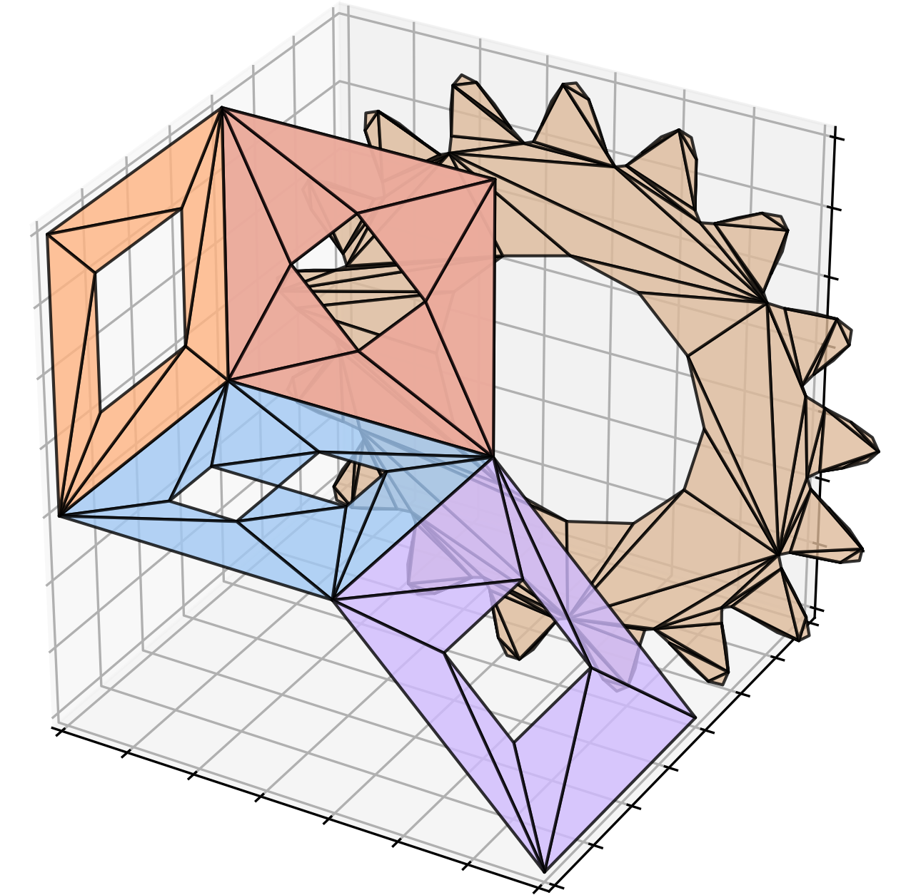

# earcut-py

A pure Python port of the [earcut](https://github.com/mapbox/earcut) polygon triangulation library.

- Based on the earcut 2.2.4 release.
- An additional utility `earcut.utils_3d` can be used to project polygons from 3D to 2D space before triangulation, instead of just ignoring z components. (requires NumPy)
- License: ISC

This project is a fork of [joshuaskelly/earcut-python](https://github.com/joshuaskelly/earcut-python).

## Usage

TODO
